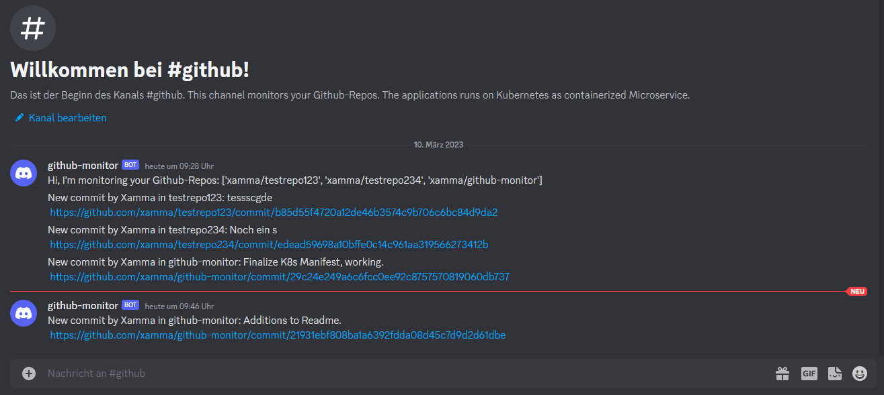

# Discord-Bot for monitoring Github Repos

[](https://github.com/xamma/github-monitor/actions/workflows/docker-image.yml)

This Bot monitors your Github repos and posts information about changes in your Discord channel.  
It uses the **PyGithub** and **discord.py** modules for interacting with the API.  



Before using the App, you have to register an Discord-Application and add the Bot to the server to obtain the ***DISCORD_TOKEN***.  
Create the ***GITHUB_TOKEN*** on your GitHub account.

## How to run
This is a microservice for running on K8s.  
Do the configuration in the ```k8s_stack.yaml```.  
Then apply the Kubernetes Manifest: ```kubectl apply -f k8s_stack.yaml```.  

### Running locally
```
python runner.py
```

### Build image
```
docker build -t discord-bot:latest .
```

### Run Container
```
docker run -d \
    -e REPO_LIST="xamma/testrepo123, xamma/testrepo234" \
    -e DISCORD_TOKEN="SECRET" \
    -e GITHUB_TOKEN="SECRET" \
    -e DISCORD_CHANNEL_ID=1082199072984797245 \
    discord-bot:latest
```